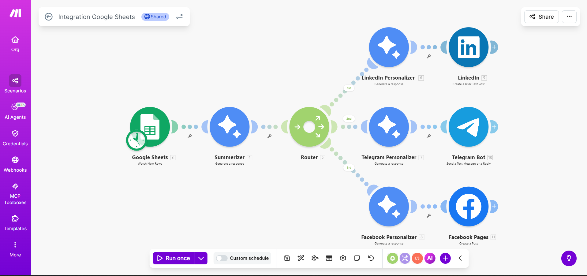

# Social-Media-AI-Automation. :  

# AI-Powered Social Media Content Automation 🚀 

Project Page : https://eu1.make.com/public/shared-scenario/0XwZGHwV4Ee/integration-google-sheets

This project is an automated content creation and posting pipeline built using Make.com, OpenAI, Google Sheets, and multiple social media integrations. 

It automatically: 
- Reads content ideas from Google Sheets 
- Generates AI-powered content 
- Customizes posts for different platforms 
- Publishes content to LinkedIn, Telegram, and Facebook automatically 

## 🔧 Tech Stack & Tools 

- Make.com (Automation & Workflow Builder) 
- OpenAI (AI Content Generation) 
- Google Sheets (Input & Data Source) 
- Telegram Bot API 
- Facebook Pages API 
- LinkedIn API 

## ⚙️ Workflow Architecture 

Google Sheets → AI Summarizer → Router →   
→ LinkedIn Personalizer → LinkedIn Post   
→ Telegram Personalizer → Telegram Bot   
→ Facebook Personalizer → Facebook Page   
 
## 🖼️ Project Flow Diagram  

 

## 🚀 Features 

- Fully automated social media posting 
- AI-based content personalization 
- Multi-platform publishing 
- Scheduled posting every 15 minutes 
- No manual effort required after setup 

## 🛠️ Setup Instructions 

1. Create scenario in Make.com   
2. Connect: 
   - Google Sheets 
   - OpenAI API 
   - Telegram Bot 
   - Facebook Page 
   - LinkedIn Account 
3. Import scenario blueprint (if available) 
4. Configure router rules 
5. Enable scheduling 

## 📌 Use Cases 

- Affiliate marketing automation   
- Personal brand building   
- Startup content marketing   
- Automated blogging & posting   

## 👨‍💻 Author 

**Sumanth**  
Electrical and Electronics Engineering | Automation & AI Enthusiast   

⭐ If you find this useful, give the repo a star! 

